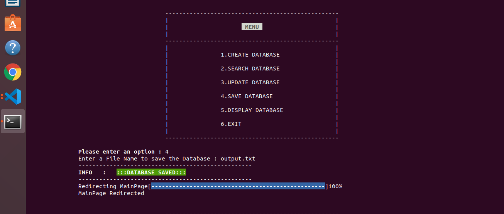

## Inverted Search

## Overview

    The Inverted Search Project is a text-processing utility that builds an inverted index from text files. 
    An inverted index is a data structure commonly used in search engines to map words to their 
    occurrences within a set of documents. This project is designed to demonstrate the 
    power of such a structure in efficiently retrieving information.

## Features

    Index Creation: Builds an inverted index from one or more text files.

    Word Search: Allows searching for specific words and retrieves the files and their respective line numbers where the words occur.

    Case Insensitivity: Performs case-insensitive searches to ensure accuracy.

    Dynamic Data Handling: Efficiently handles varying file sizes and content.

    Menu-Driven Interface: User-friendly interface to perform operations step by step.

## Applications

    Search engines.

    Text analytics.

    Natural language processing (NLP) tools.

## Technologies Used

    Programming Language: C

    File Handling: For reading/writing BMP and text files.

    Bitwise Operations: For encoding and decoding data at the bit level.

## Installation

    Prerequisites

        A Linux-based system or Windows with GCC installed.

        Basic knowledge of terminal commands.

    Clone the Repository:

        git clone <repository-url>
        cd <repository-folder>

    Compile the Code on windows machine:
        Use the GCC compiler to compile the source files:

        gcc -o inverted_search <all files> -lm

    Run the program on windows machine:
    
        ./inverted_search

    Compile the Code on linux machine:

        gcc *.c

    Run the program on windows machine:
    
        ./a.out file1.txt file2.txt    

## Screenshots
Input validation:

Create Database:

Search Database:

Update Database:

Save Database:

Display Database:

## File Structure

    main.h: File containing all function and structure declarations.

    main.c: Main program file containing function calls and prints the output to the screen.

    createHashTable.c: This program file validates the cmd arguments and creates hashtable. 

    createDatabase.c: This program file create's database based on the file linked list.

    searchDatabase.c: This program file search the database based on the user input.

    updateDatabase.c: This program file update the database based on the user input.

    saveDatabase.c: This program file save's database and creates a text file with database data.

    displayDatabase.c: This program file display's database.

    insert_last.c: This program file insert the data into the linked list.

    printList.c: This program file prints the list

    file1.txt: This program file contains the data which need to be inserted into database.

    file2.txt: This program file contains the data which need to be inserted into database.

    assests/screenshots/: Folder containing screenshots of the application.

## Learning Outcomes

    Mastery of file handling operations and operations like insertion, deletion on hashtable.

    Enhanced problem-solving skills in inserting words on array of linked lists.

    Debugging and testing in a Linux environment.

## Contributing

    Contributions are welcome! Feel free to fork the repository, make changes, and submit a pull request. Please ensure that your code adheres to the project’s coding standards.

## Future Enhancements

    Support for additional file formats (e.g., PDF, DOCX).

    GUI-based interface for improved usability.

    Advanced search options like phrase searching and wildcard support.

    Integration with databases for persistent storage of indices.

## License

    This project is licensed under the MIT License.

## Contact

    For questions or suggestions, feel free to reach out:

    Name: OpenSource Sorcerer

    Email: [balanagu77@gmail.com]

## Acknowledgments

    Special thanks to the open-source community for inspiration and resources.
